# DarkSignal

A lightweight security simulation platform designed to emulate real-world identity-based attacks, monitor critical behaviors, and generate actionable alerts.

---

## 📋 Table of Contents

- [Overview](#overview)
- [Features](#features)
- [Roadmap & In-Progress Features](#roadmap--in-progress-features)
- [Screenshots & Demo](#screenshots--demo)
- [Architecture](#architecture)
- [Prerequisites](#prerequisites)
- [Installation](#installation)
- **Root Level**
  - [Root Configuration](#root-configuration)
  - [Running the Application](#running-the-application)
- **[src/](#src---application-source-code)** - Application Source Code
- **[routes/](#routes---flask-blueprints)** - Flask Blueprints & API Routes
- **[services/](#services---business-logic)** - Business Logic Services
- **[templates/](#templates---html-views)** - HTML Templates & Views
- **[static/](#static---assets)** - CSS, Images & Static Assets
- **[scripts/](#scripts---utility-scripts)** - Utility & Monitoring Scripts
- **[infra/](#infra---kubernetes-infrastructure)** - Kubernetes Infrastructure
  - [infra/namespaces/](#infranamespaces---kubernetes-namespaces)
  - [infra/web_app/](#infrawebbapp---flask-app-deployment)
  - [infra/prometheus/](#infraprometheus---monitoring)
  - [infra/grafana/](#infografana---dashboards)
  - [infra/alertmanager/](#infraalertmanager---alerting)
  - [infra/script/](#infrascript---kubernetes-jobs)
- **[terraform/](#terraform---infrastructure-as-code)** - Infrastructure as Code (Terraform)
  - [terraform/bootstrap/](#terraformbootstrap---aws-bootstrap)
  - [terraform/eks/](#terraformeks---aws-eks-cluster)
- **[.github/workflows/](#githubworkflows---cicd-pipeline)** - CI/CD Pipeline
- [Contributing](#contributing)
- [License](#license)

---

## Overview

DarkSignal provides a comprehensive security simulation environment for:
- **Attack Emulation**: Simulate identity-based and behavioral attacks
- **Real-time Monitoring**: Track and log critical security events
- **Alerting**: Generate actionable alerts based on threat patterns
- **Observability**: Full observability stack with Prometheus and Grafana

### Tech Stack

- **Frontend**: HTML5, CSS3, JavaScript
- **Backend**: Python 3.11+ with Flask
- **Database**: SQLite (lightweight, file-based)
- **Container**: Docker
- **Orchestration**: Kubernetes
- **Infrastructure as Code**: Terraform
- **Cloud Provider**: AWS (EKS, EC2, IAM, VPC)
- **Monitoring**: Prometheus + Grafana + AlertManager
- **Observability**: OpenTelemetry (OTEL)
- **CI/CD**: GitHub Actions

---

## Features

- ✅ Lightweight Flask-based web application
- ✅ Containerized deployment with Docker
- ✅ Full Kubernetes infrastructure (namespaces, deployments, services, configmaps)
- ✅ Integrated monitoring stack (Prometheus, Grafana, AlertManager)
- ✅ OpenTelemetry instrumentation for distributed tracing
- ✅ Automated CI/CD pipeline with GitHub Actions
- ✅ Identity-based attack simulation
- ✅ Real-time behavioral monitoring

---

## Roadmap & In-Progress Features

DarkSignal is actively being developed with the following attack simulation features in progress:

### Currently Implementing

| Feature | Status | Description | Priority |
|---------|--------|-------------|----------|
| **SQL Injection** | 🔨 In Progress | Simulate SQL injection attacks and detection | High |
| **Phishing** | 🔨 In Progress | Email phishing campaign emulation and tracking | High |
| **Privilege Escalation** | 🔨 In Progress | Escalate user privileges and track unauthorized access | High |
| **Brute Force Attack** | 🔨 In Progress | Automated login brute force attempts with rate limiting | High |
| **API Abuse** | 🔨 In Progress | Excessive API calls, DDoS patterns, and throttling | Medium |


### Implementation Notes

Each attack feature includes:
- **Attack Simulation**: Code that executes the attack pattern
- **Logging**: Comprehensive event logging for audit trails
- **Metrics**: Prometheus metrics for attack frequency and success rates
- **Alerts**: AlertManager rules to trigger on detection
- **Dashboard**: Grafana visualizations for security analysts

---

## Screenshots & Demo

Complete visual demonstration of DarkSignal meeting all mandatory technical requirements and bonus features.

### Quick Navigation

| Mandatory Requirements | Bonus Features |
|---|---|
| [1. Application & Metrics](#1-application--metrics-generation) | [7. AlertManager Notifications](#7-alertmanager-notifications) |
| [2. Kubernetes Deployment](#2-kubernetes-deployment) | [8. Infrastructure as Code](#8-infrastructure-as-code) |
| [3. Prometheus Scraping](#3-prometheus-scraping) | [9. CI/CD Pipeline](#9-cicd-pipeline) |
| [4. Grafana Dashboards](#4-grafana-dashboards) |
| [5. AlertManager Deployment](#5-alertmanager-alerts) |
| [6. GitHub Documentation](#6-github-repository-documentation) |

---

## 1. Application & Metrics Generation

**Requirement**: Create an application that generates metrics or alerts.

**Implementation Details**:
- Flask-based Python web application with built-in metrics export
- OpenTelemetry (OTEL) instrumentation for distributed tracing
- Prometheus metrics endpoint (`/metrics`)
- Real-time security event logging and alerting

#### 1.1 Authentication

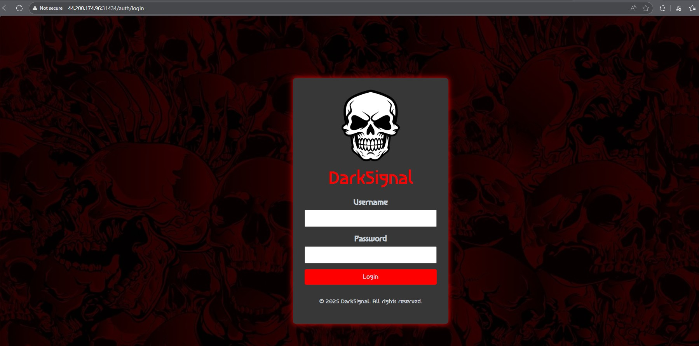

Users authenticate via SQLite-backed login system embedded in the Docker image.

#### 1.2 Dashboard & Interface

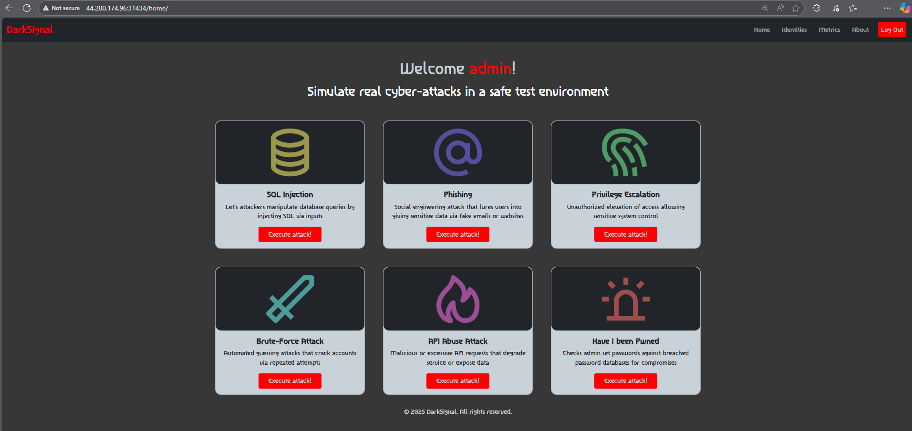

Main application dashboard displaying available security features. Currently features the Have I Been Pwned (HIBP) password checker.

#### 1.3 Feature Demonstration: Password Security Check

**Testing with Weak Password** (compromised):

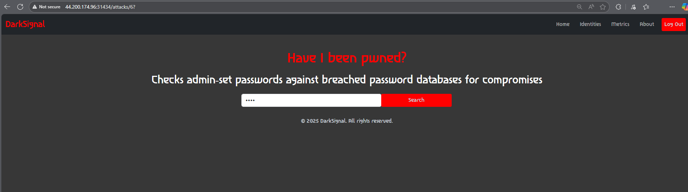

Search interface for password vulnerability checking.

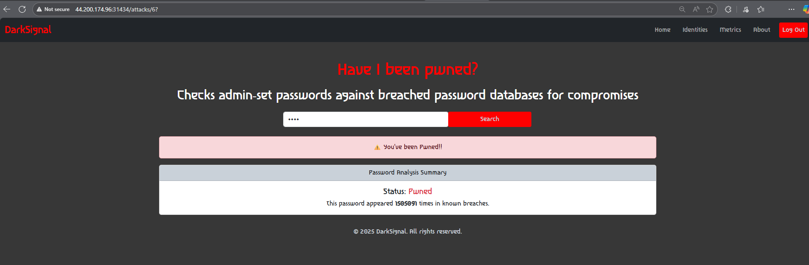

Results showing a password that appears in known breach databases.

**Testing with Strong Password** (secure):

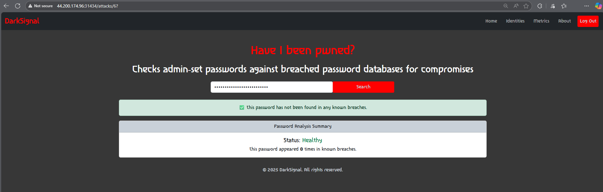

Results showing a secure password with no known breaches.

#### 1.4 Metrics Endpoint

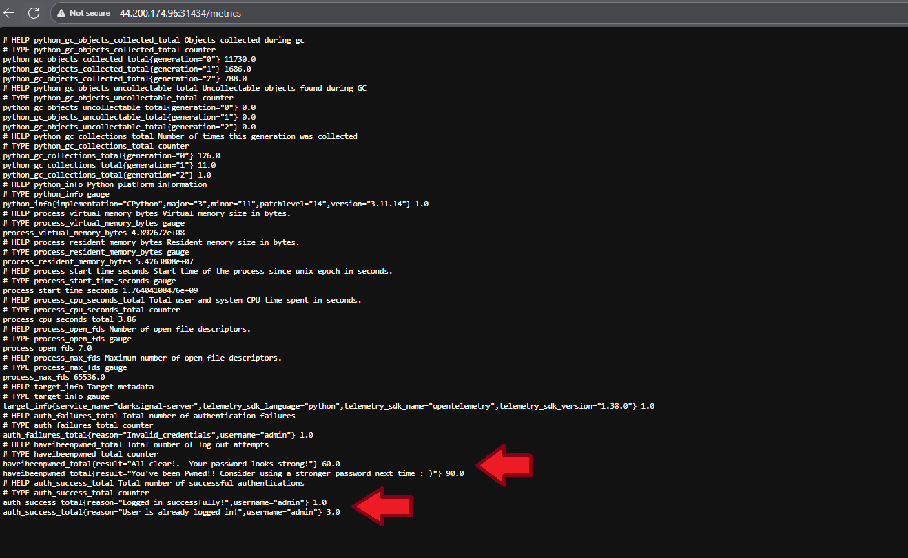

Custom Prometheus metrics exposed at `/metrics` endpoint. This is the scrape target for Prometheus to collect application telemetry.

---

## 2. Kubernetes Deployment

**Requirement**: Deploy application using Kubernetes (EKS, AKS, Minikube, k3d, etc.).

**Implementation Details**:
- Production-grade AWS EKS cluster via Infrastructure as Code (Terraform)
- Modular deployment with isolated namespaces
- Support for local testing with Minikube/k3d
- Complete manifest-based configuration

#### 2.1 Cluster Overview

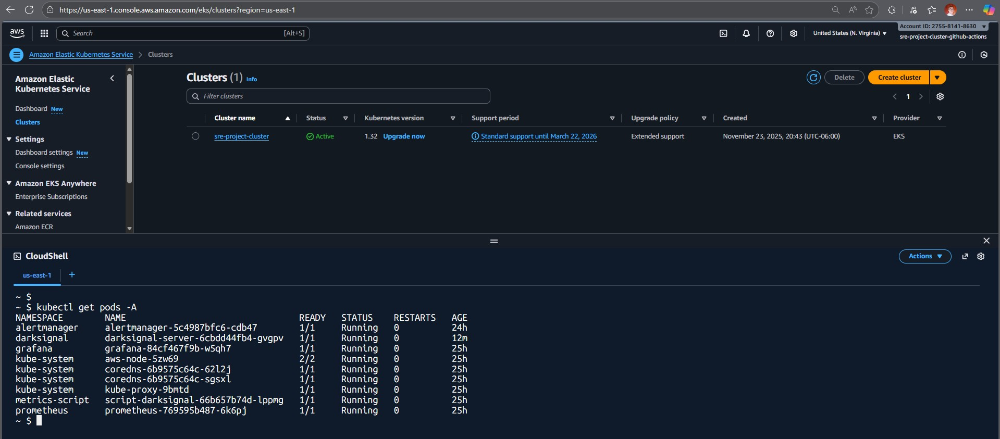

Terminal view showing all deployed pods across namespaces.

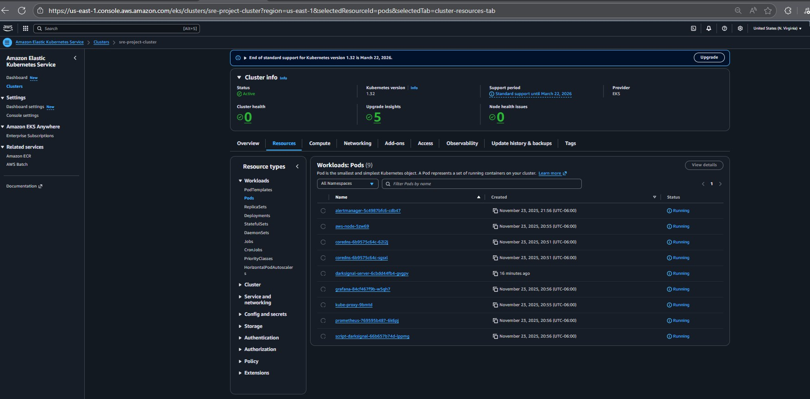

AWS console UI displaying pod deployments and health status.

#### 2.2 Network Configuration

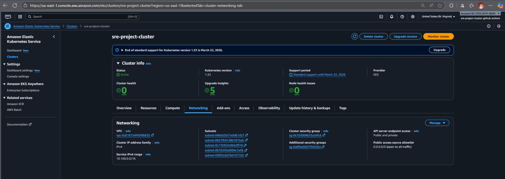

VPC and network setup for inter-pod communication and external access.

#### 2.3 Node Infrastructure

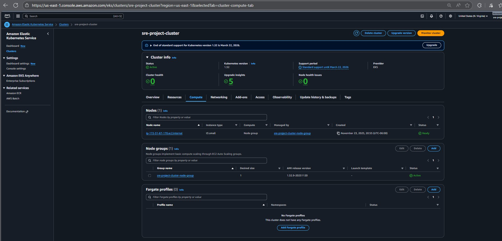

Node group configuration showing compute resources allocation.

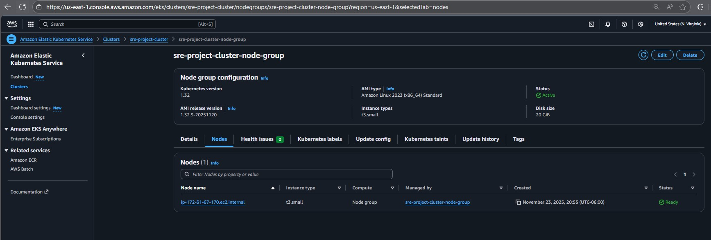

Active nodes running in the node group.

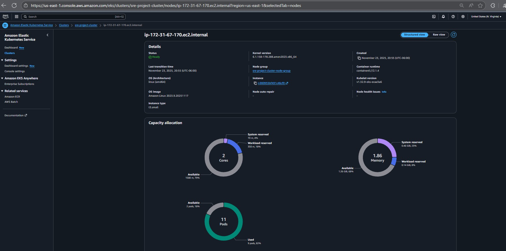

Node metrics and performance statistics.

#### 2.4 EC2 Infrastructure

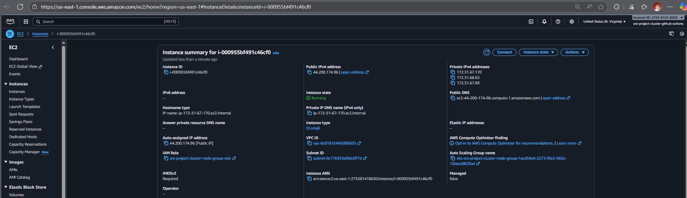

Underlying EC2 instances powering the Kubernetes cluster.

---

## 3. Prometheus Scraping

**Requirement**: Deploy Prometheus and configure it to scrape metrics from the application.

**Implementation Details**:
- Prometheus deployment in Kubernetes cluster
- Configured scrape jobs targeting application metrics endpoint
- OpenTelemetry metrics export integration
- Custom alert rules for security events

#### 3.1 Scrape Targets

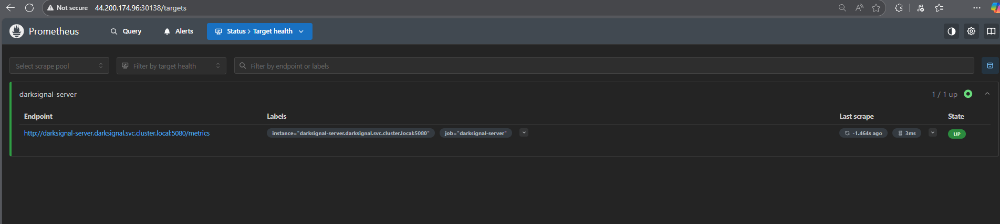

Prometheus targets dashboard showing all configured scrape endpoints and their health status.

#### 3.2 Metrics Collection

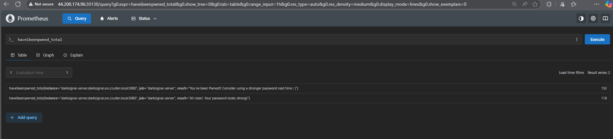

Evidence of successful metric scraping from the DarkSignal application.

#### 3.3 Alert Rules

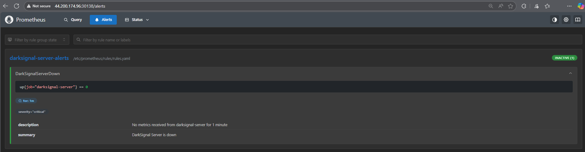

Configured alert rules with PromQL queries for triggering notifications on security events.

---

## 4. Grafana Dashboards

**Requirement**: Deploy Grafana and visualize metrics from Prometheus using dashboards.

**Implementation Details**:
- Grafana deployment with Prometheus datasource
- Custom dashboards for security metrics visualization
- Real-time metric updates and trending

#### 4.1 Datasource Configuration

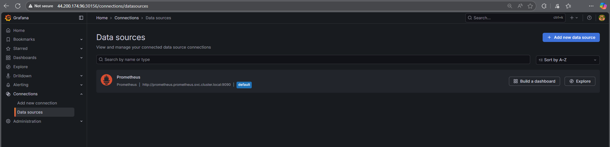

Prometheus datasource successfully configured in Grafana.

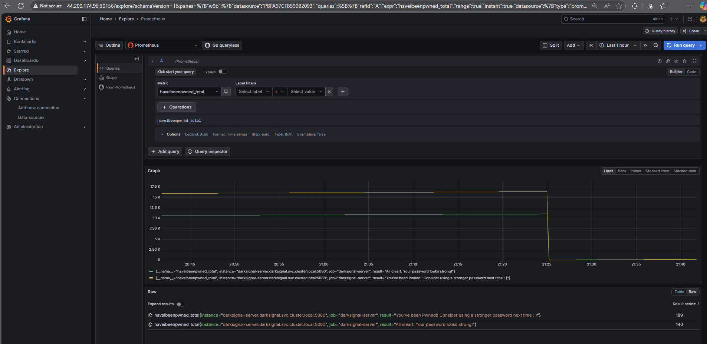

Grafana validating data collection from Prometheus.

#### 4.2 Custom Dashboard

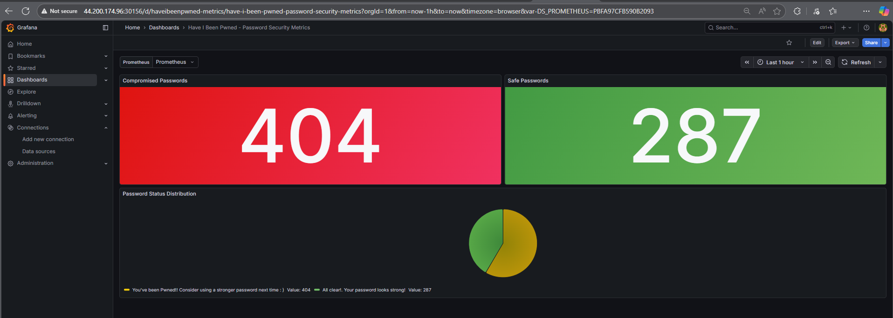

Custom dashboard visualizing password security metrics and application health.

#### 4.3 Dashboard Configuration

**File**: `haveibeenpwned-dashboard.json`

The Have I Been Pwned dashboard is configured as a Grafana JSON model for easy import and deployment.

**Dashboard Metadata**:
- **Title**: Have I Been Pwned - Password Security Metrics
- **UID**: haveibeenpwned-metrics
- **Theme**: Dark mode
- **Time Range**: Last 1 hour (configurable)
- **Schema Version**: 38 (Grafana 10.0+)
- **Tags**: security, passwords, haveibeenpwned, metrics

**Datasource Configuration**:
- Uses template variable `${DS_PROMETHEUS}` for dynamic Prometheus datasource selection
- Allows the dashboard to be imported across different Grafana instances without hardcoding datasource UIDs
- Auto-discovers available Prometheus datasources during import

**Dashboard Panels**:

1. **Compromised Passwords** (Stat Panel)
   - **Position**: Top-left (0, 0)
   - **Size**: 12 columns × 8 rows
   - **Color Scheme**: Red (thresholds)
   - **PromQL Query**: 
     ```promql
     haveibeenpwned_total{result=~"You've been Pwned.*"}
     ```
   - **Display**: Shows count of passwords found in breach databases
   - **Calculation**: Last non-null value (real-time count)

2. **Safe Passwords** (Stat Panel)
   - **Position**: Top-right (12, 0)
   - **Size**: 12 columns × 8 rows
   - **Color Scheme**: Green (thresholds)
   - **PromQL Query**:
     ```promql
     haveibeenpwned_total{result=~"All clear.*"}
     ```
   - **Display**: Shows count of secure passwords
   - **Calculation**: Last non-null value (real-time count)

3. **Password Status Distribution** (Pie Chart)
   - **Position**: Full-width bottom (0, 8)
   - **Size**: 24 columns × 8 rows
   - **PromQL Query**:
     ```promql
     haveibeenpwned_total
     ```
   - **Display**: Pie chart showing ratio of compromised vs. safe passwords
   - **Legend**: Shows by result label with values
   - **Visualization**: Proportional representation of password security status

**Key Features**:

- **Portable**: Template variable approach works across any Grafana installation
- **Real-time Updates**: Metrics refresh automatically based on Prometheus scrape interval
- **Professional Styling**: Dark theme with color-coded visual indicators
- **Security-focused**: Clear visual distinction between compromised (red) and safe (green) states
- **Production-ready**: Follows Grafana best practices and JSON schema standards

**Deployment**:

To import this dashboard:

1. Copy `haveibeenpwned-dashboard.json` to your Grafana instance
2. Navigate to **Dashboards → Import**
3. Upload the JSON file
4. Select your Prometheus datasource when prompted
5. Click **Import**

The dashboard will automatically populate with metrics from your Prometheus instance.

---

## 5. AlertManager Deployment

**Requirement**: Deploy AlertManager for alert routing and notification management.

**Implementation Details**:
- AlertManager deployment in Kubernetes cluster
- Integration with Prometheus alert evaluation
- Multi-channel notification support (email, Slack)
- Alert grouping and deduplication

#### 5.1 AlertManager Status

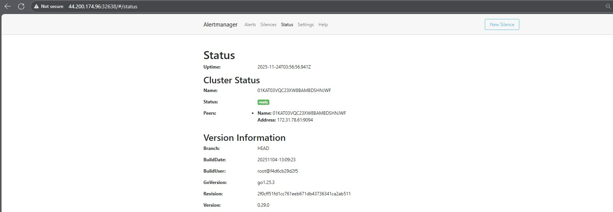

AlertManager successfully deployed and operational in the cluster.

---

## 6. GitHub Repository Documentation

**Requirement**: Comprehensive GitHub repository with professional documentation.

**Implementation Details**:
- Well-structured README with complete architecture documentation
- CONTRIBUTING.md with development guidelines and standards
- LICENSE file with security and legal disclaimers
- Organized folder structure following best practices
- Complete screenshot evidence and deployment guides

#### 6.1 Repository Structure

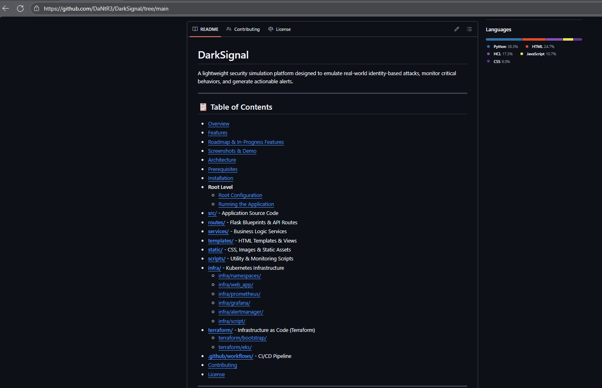

GitHub repository showing professional organization and comprehensive documentation.

---

## 7. AlertManager Notifications

**Bonus Feature**: End-to-end alert notification system with Slack and Email integration.

**Scenario**: Simulating application downtime and verifying alert delivery through multiple channels.

#### 7.1 Triggering the Alert

**Initial State**: Application running with 1 replica.

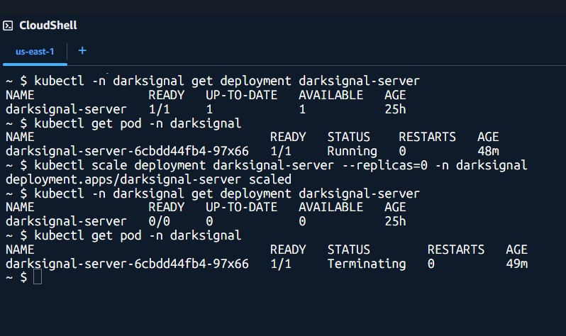

Scaling down the application to 0 replicas to simulate downtime.

**Detection**: Prometheus detects connection failure.


Prometheus target status shows application is DOWN.

#### 7.2 Alert Escalation

**Queued**: Alert condition met but within grace period.

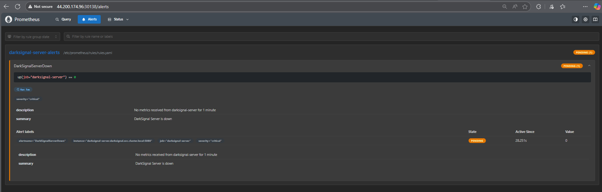

Alert transitioning from PENDING to FIRING state.

**Fired**: Alert threshold exceeded, firing to AlertManager.

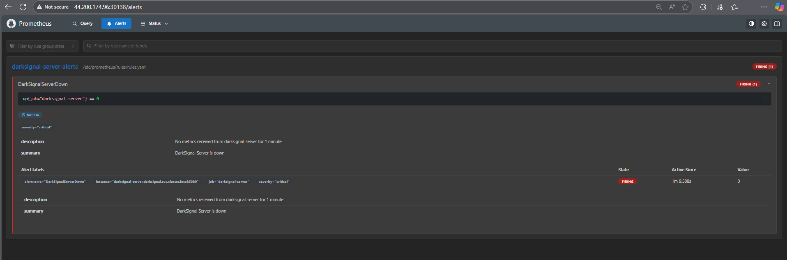

Alert actively firing in Prometheus.

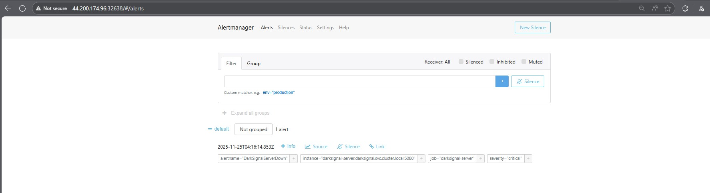

AlertManager receiving the alert and preparing notifications.

#### 7.3 Notifications Delivered

**Slack Alert**:

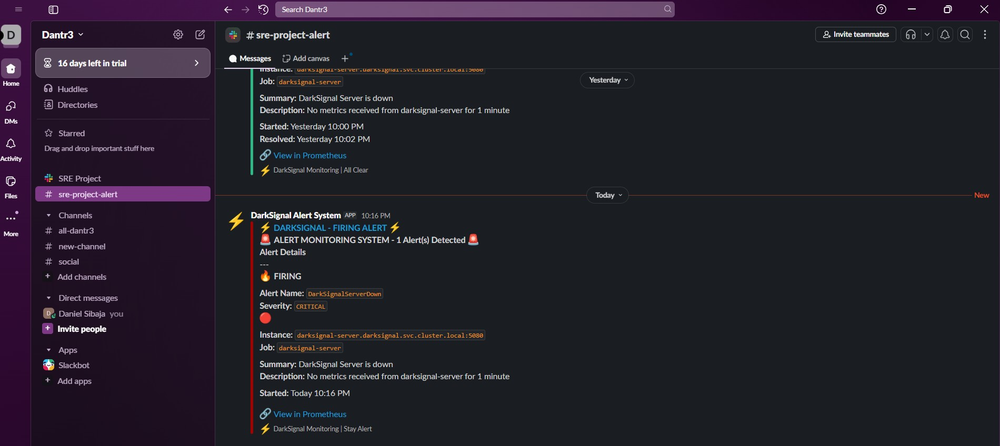

Real-time Slack notification alerting on-call engineer of application outage.

**Email Alert**:

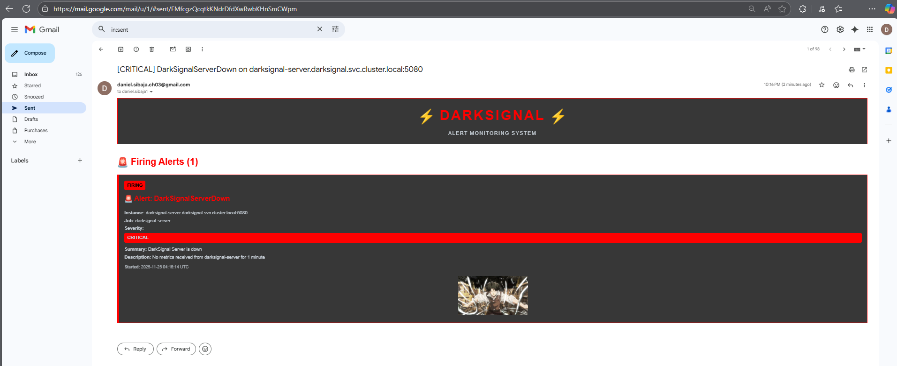

Email notification with detailed alert context and severity level.

#### 7.4 Recovery & Resolution

**Restoring Service**: Scaling application back to 1 replica.

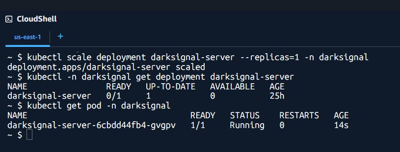

Scaling up the application to restore service.

**Resolution Notifications**: Once service is restored, resolved notifications are sent.

**Slack Resolution**:

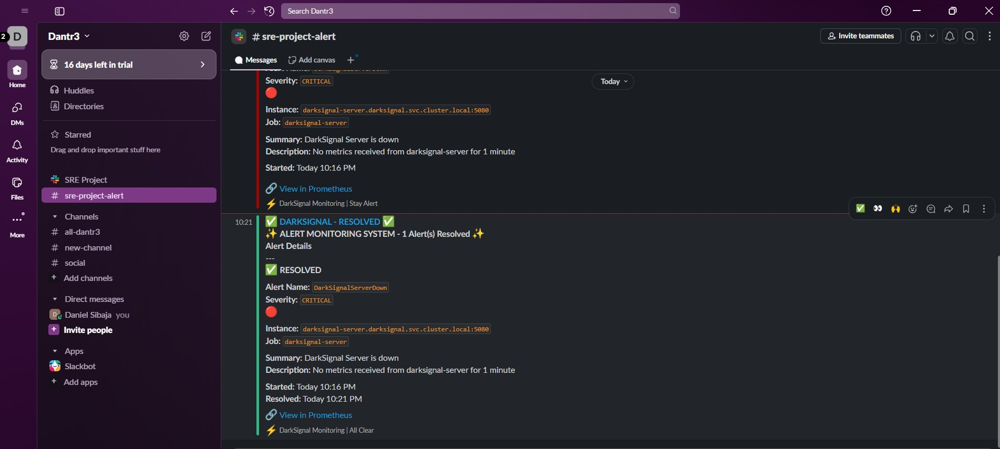

Slack notification confirming service recovery.

**Email Resolution**:

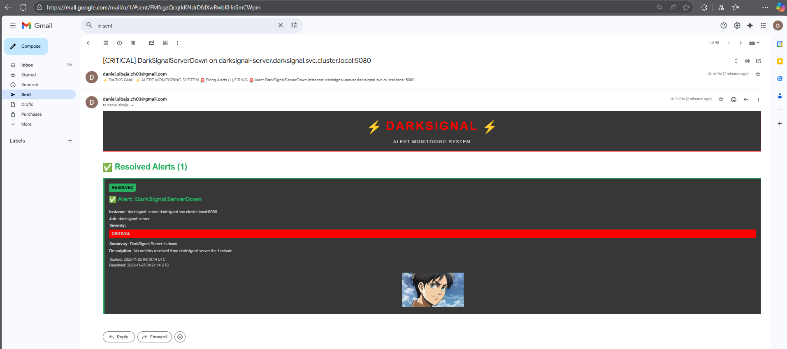

Email notification indicating alert has been resolved.


## Project Completion Checklist

### Mandatory Requirements (6/6)
- [ ] **Requirement 1**: Application generates metrics/alerts ✅
- [ ] **Requirement 2**: Kubernetes deployment (EKS/k3d/Minikube) ✅
- [ ] **Requirement 3**: Prometheus scraping configured ✅
- [ ] **Requirement 4**: Grafana dashboards connected ✅
- [ ] **Requirement 5**: AlertManager deployed ✅
- [ ] **Requirement 6**: GitHub documentation complete ✅

### Bonus Features
- [ ] AlertManager notifications (Slack/Email) ✅
- [ ] Infrastructure as Code (Terraform) ✅
- [ ] CI/CD pipeline (GitHub Actions) ✅

### Documentation Completeness
- [ ] README.md (well-structured, clear)
- [ ] CONTRIBUTING.md (guidelines provided)
- [ ] LICENSE (with security disclaimer)
- [ ] Code (organized and commented)
- [ ] Screenshots (evidence captured)

---


## Architecture

```
┌─────────────────────────────────────────────┐
│         GitHub Actions CI/CD Pipeline        │
│  (Trigger: push/PR to src/ or infra/)       │
└──────────────────────┬──────────────────────┘
                       │
                       ▼
        ┌──────────────────────────────┐
        │   Build Docker Image         │
        │ (ghcr.io/DaNtR3/DarkSignal)  │
        └──────────────┬───────────────┘
                       │
                       ▼
        ┌──────────────────────────────┐
        │  Deploy to Kubernetes        │
        │  (kubectl apply)             │
        └──────────────┬───────────────┘
                       │
        ┌──────────────┴──────────────┐
        │                             │
        ▼                             ▼
   ┌─────────────┐         ┌──────────────────┐
   │  Web App    │         │  Monitoring      │
   │  Namespace  │         │  Stack           │
   │  - Flask    │         │  - Prometheus    │
   │  - App      │         │  - Grafana       │
   │  - Services │         │  - AlertManager  │
   └─────────────┘         └──────────────────┘
```

---

## Prerequisites

- **Python 3.11+**
- **Docker** (for containerization)
- **kubectl** (for Kubernetes management)
- **Kubernetes cluster** (local or cloud-based)
- **Git** (for version control)

### Optional

- **Helm** (for advanced deployments)
- **kind** or **minikube** (for local Kubernetes cluster)

---

## Installation

### 1. Clone the Repository

```bash
git clone https://github.com/DaNtR3/DarkSignal.git
cd DarkSignal
```

### 2. Create Python Virtual Environment

```bash
python -m venv venv
source venv/bin/activate  # On Windows: venv\Scripts\activate
```

### 3. Install Dependencies

```bash
pip install -r requirements.txt
```

### 4. Configure Environment Variables

Create a `.env` file in the project root:

```env
FLASK_ENV=development
FLASK_APP=app.py
DEBUG=True
OTEL_EXPORTER_OTLP_ENDPOINT=http://localhost:4317
```

---

## Root Configuration

### Key Root Files

| File | Purpose |
|------|---------|
| `app.py` | Flask application entry point |
| `dockerfile` | Docker image build configuration |
| `requirements.txt` | Python dependencies (pip) |
| `.env` | Environment variables (local development) |

### Environment Variables

The application uses the following environment variables:

```env
FLASK_ENV=development          # Flask environment (development/production)
FLASK_APP=app.py               # Flask app module
DEBUG=True                      # Debug mode
OTEL_EXPORTER_OTLP_ENDPOINT=http://localhost:4317  # OpenTelemetry collector
```

---

## Running the Application

### Local Development

```bash
python app.py
```

The application will be available at `http://localhost:5090`

### Docker

```bash
docker build -t darksignal:latest -f dockerfile .
docker run -p 5090:5090 darksignal:latest
```

---

## src/ - Application Source Code

Contains the core application logic and handlers.

### Structure

```
src/
└── handlers/
    └── year_handler.py       # Utility functions for date/time handling
```

### Key Files

- **`year_handler.py`**: Contains `current_year()` function used throughout the application for displaying the current year in templates

### Usage Example

```python
from src.handlers.year_handler import current_year

year = current_year()  # Returns current year as string
```

---

## routes/ - Flask Blueprints

Defines API endpoints and route handlers using Flask Blueprints for modular architecture.

### Structure

```
routes/
└── auth_routes.py             # Authentication-related endpoints
```

### API Endpoints

#### Authentication Blueprint (`/auth`)

| Method | Endpoint | Handler | Purpose |
|--------|----------|---------|---------|
| GET | `/auth/user` | `get_user()` | Retrieve current user |
| POST | `/auth/users` | `create_user()` | Create a new user |

### Registering Blueprints

In `app.py`:

```python
from routes.auth_routes import auth_bp

app.register_blueprint(auth_bp, url_prefix='/auth')
```

### Creating New Blueprints

```python
# routes/new_feature_routes.py
from flask import Blueprint

new_bp = Blueprint('new_feature', __name__)

@new_bp.route('/endpoint', methods=['GET'])
def endpoint_handler():
    return {"status": "success"}
```

Then register in `app.py`:

```python
app.register_blueprint(new_bp, url_prefix='/new-feature')
```

---

## services/ - Business Logic

Contains service classes and functions for business operations.

### Structure

```
services/
└── auth_service.py            # Authentication service logic
```

### Services Overview

- **`AuthService`**: Handles user authentication, validation, and authorization logic

### Adding New Services

```python
# services/example_service.py
class ExampleService:
    @staticmethod
    def process_data(data):
        # Business logic here
        return processed_data
```

---

## templates/ - HTML Views

Contains Jinja2 HTML templates for rendering pages.

### Structure

```
templates/
├── base.html                  # Base template (header, footer)
├── login.html                 # Login page
├── home_page.html             # Home/dashboard page
├── 404.html                   # Error page
└── partials/                  # Reusable template components
    ├── header.html
    ├── navbar.html
    └── footer.html
```

### Template Inheritance

All templates extend `base.html`:

```html



  <!-- Page-specific content -->

```

### Using Helpers in Templates

```html
<!-- Display current year -->
<footer>&copy; {{ current_year }} DarkSignal. All rights reserved.</footer>
```

### Serving Templates

In routes:

```python
from flask import render_template
from src.handlers.year_handler import current_year

@app.route('/login', methods=['GET', 'POST'])
def login():
    return render_template('login.html', 
                          custom_css='css/styles_login.css',
                          current_year=current_year())
```

---

## static/ - Assets

Contains CSS stylesheets and image files.

### Structure

```
static/
├── css/
│   ├── background_body.css    # Body background styling
│   ├── generals.css           # General/common styles
│   ├── styles_404.css         # Error page styles
│   ├── styles_login.css       # Login page styles
│   └── styles_main.css        # Main application styles
└── images/                    # Static images and assets
```

### CSS Organization

- **`generals.css`**: Shared styles (colors, fonts, spacing)
- **`background_body.css`**: Body-wide styling
- **`styles_*.css`**: Page-specific stylesheets

### Linking Stylesheets in Templates

```html
<link rel="stylesheet" href="{{ url_for('static', filename='css/styles_main.css') }}">
```

---

## scripts/ - Utility Scripts

Contains standalone Python scripts for testing, metrics generation, and monitoring tasks.

### Structure

```
scripts/
├── metric-scripts.py          # Password checker and metrics generator
├── requirements.txt           # Python dependencies for scripts
└── dockerfile                 # Docker image for running scripts
```

### metric-scripts.py

**Purpose**: Continuously generates metrics by checking passwords against a weakness database (PWNED API)

**What it does**:
- Sends repeated password check requests to `/pwned/check-password` endpoint
- Generates realistic traffic patterns with mixed weak and strong passwords
- Logs results and HTTP status codes
- Useful for load testing and metric generation for Prometheus

**Configuration**:

The script reads from environment variables:

```env
API_URL=http://127.0.0.1:44805/pwned/check-password    # Target API endpoint
SESSION_COOKIE=""                                        # Optional session cookie
INTERVAL=3                                               # Seconds between requests
WEAK_RATIO=0.7                                           # 70% weak passwords, 30% strong
```

**Weak Passwords Used**:
- `password123`
- `123456`
- `qwerty`
- `admin123`
- `letmein`

**Strong Passwords Used**:
- `X9$mK2@pL7&nQ4!vT8`
- `P@ssw0rd!2024#Secure`
- `My$uper$tr0ng!Pass`

**Running Locally**:

```bash
cd scripts

# Install dependencies
pip install -r requirements.txt

# Run the script
API_URL=http://localhost:5090/pwned/check-password INTERVAL=5 python metric-scripts.py
```

**Output Example**:

```
⚡ DarkSignal Metric Generator
Target: http://127.0.0.1:44805/pwned/check-password
Interval: 3s
Starting...

[1] 🔴 PWNED - 12 times
[2] ✅ SAFE
[3] 🔴 PWNED - 8 times
[4] ⚠️  Status: 200
```

**Running in Docker**:

```bash
# Build Docker image
docker build -f scripts/dockerfile -t darksignal-metrics:latest .

# Run with environment variables
docker run -e API_URL=http://host.docker.internal:5090/pwned/check-password \
           -e INTERVAL=3 \
           -e WEAK_RATIO=0.7 \
           darksignal-metrics:latest
```

**Running in Kubernetes**:

The `infra/script/` manifests deploy this script as a Kubernetes Job or Deployment with proper configmaps for environment configuration.

### requirements.txt

Dependencies for the scripts:

- **python-dotenv** (>=1.0.0) - Load environment variables from `.env` files
- **requests** (>=2.31.0) - HTTP client for API calls

### dockerfile

Containerizes the metric script for deployment:

```dockerfile
FROM python:3.11-slim
WORKDIR /script
COPY . /script
RUN pip install -r requirements.txt
CMD ["python", "metric-scripts.py"]
```

**Use Cases**:
- Continuous load testing for application metrics
- Stress testing Prometheus and Grafana
- Generating realistic traffic patterns for alerting rules

---

## infra/ - Kubernetes Infrastructure

Complete Kubernetes manifest definitions for deploying DarkSignal and its monitoring stack.

### Overall Structure

```
infra/
├── namespaces/                # Kubernetes namespace definitions
├── web_app/                   # Flask application deployment
├── prometheus/                # Prometheus monitoring
├── grafana/                   # Grafana dashboards
├── alertmanager/              # AlertManager alerting
└── script/                    # Additional Kubernetes jobs
```

### Deployment Order

Always deploy in this order:

```bash
1. kubectl apply -f infra/namespaces/
2. kubectl apply -f infra/alertmanager/
3. kubectl apply -f infra/prometheus/
4. kubectl apply -f infra/grafana/
5. kubectl apply -f infra/web_app/
6. kubectl apply -f infra/script/
```

---

## infra/namespaces/ - Kubernetes Namespaces

Defines isolated Kubernetes namespaces for different services.

### Files

- **`app_namespace.yaml`**: Namespace for the Flask web application
- **`prometheus_namespace.yaml`**: Namespace for Prometheus monitoring
- **`grafana_namespace.yaml`**: Namespace for Grafana dashboards
- **`alertmanager_namespace.yaml`**: Namespace for AlertManager
- **`script_namespace.yaml`**: Namespace for utility scripts and jobs

### Deploy Namespaces

```bash
kubectl apply -f infra/namespaces/
```

### Verify Namespaces

```bash
kubectl get namespaces
```

---

## infra/web_app/ - Flask App Deployment

Kubernetes manifests for deploying the Flask application.

### Files

| File | Purpose |
|------|---------|
| `deployment.yaml` | Pod deployment specification |
| `service.yaml` | Kubernetes Service (networking) |
| `configmap.yaml` | Configuration data (non-secret) |

### Key Configuration

- **Namespace**: `app-namespace`
- **Port**: `5090`
- **Replicas**: Defined in `deployment.yaml`

### Deploy Web App

```bash
kubectl apply -f infra/web_app/
```

### Port Forward (Local Access)

```bash
kubectl port-forward svc/web-app 5090:5090 -n app-namespace
```

Then access: `http://localhost:5090`

### View Logs

```bash
kubectl logs -f deployment/web-app -n app-namespace
```

---

## infra/prometheus/ - Monitoring

Prometheus configuration for scraping metrics from the application.

### Files

- **`prometheus-deployment.yaml`**: Prometheus pod definition
- **`prometheus-service.yaml`**: Prometheus service (port 9090)
- **`prometheus-config.yaml`**: Scrape targets and settings
- **`prometheus-alertmanager-rules.yaml`**: Alert rules for AlertManager

### Key Features

- Scrapes metrics from Flask app (OTEL instrumentation)
- Stores time-series data
- Evaluates alert rules
- 15-second scrape interval (configurable)

### Deploy Prometheus

```bash
kubectl apply -f infra/prometheus/
```

### Access Prometheus UI

```bash
kubectl port-forward svc/prometheus 9090:9090 -n prometheus-namespace
```

Then visit: `http://localhost:9090`

### Query Metrics

Example PromQL queries:

```promql
# Request rate
rate(flask_http_request_duration_seconds_count[1m])

# Error rate
rate(flask_http_exceptions_total[1m])

# Application uptime
up{job="darksignal"}
```

---

## infra/grafana/ - Dashboards

Grafana dashboards for visualizing Prometheus metrics.

### Files

- **`grafana-deployment.yaml`**: Grafana pod definition
- **`grafana-service.yaml`**: Grafana service (port 3000)
- **`grafana-config.yaml`**: Datasources, dashboard provisioning, settings

### Default Credentials

- **Username**: `admin`
- **Password**: (Check `grafana-config.yaml` or Kubernetes secret)

### Deploy Grafana

```bash
kubectl apply -f infra/grafana/
```

### Access Grafana

```bash
kubectl port-forward svc/grafana 3000:3000 -n grafana-namespace
```

Then visit: `http://localhost:3000`

### Add Prometheus Datasource

1. Settings → Data Sources
2. Add Prometheus
3. URL: `http://prometheus:9090` (internal K8s DNS)
4. Save

### Create Custom Dashboards

Visualize metrics using PromQL queries in dashboard panels.

---

## infra/alertmanager/ - Alerting

AlertManager handles alert routing, grouping, and notifications.

### Files

- **`alertmanager-deployment.yaml`**: AlertManager pod definition
- **`alertmanager-service.yaml`**: AlertManager service (port 9093)
- **`alertmanager-config.yaml`**: Alert routing and notification settings
- **`alertmanager-example.yaml`**: Example configuration
- **`alertmanager-config-template.yaml`**: Configuration template

### Key Configuration

Alerts are triggered by Prometheus rules and routed via AlertManager to:

- Email
- Slack

### Deploy AlertManager

```bash
kubectl apply -f infra/alertmanager/
```

### Access AlertManager UI

```bash
kubectl port-forward svc/alertmanager 9093:9093 -n alertmanager-namespace
```

Then visit: `http://localhost:9093`

### Configure Notifications

Edit `alertmanager-config.yaml` to set up notification channels:

```yaml
route:
  receiver: 'default'
  group_wait: 10s
  group_interval: 10s
  repeat_interval: 12h

receivers:
  - name: 'default'
    slack_configs:
      - api_url: '<your-slack-webhook>'
        channel: '#alerts'
```

---

## infra/script/ - Kubernetes Jobs

Utility scripts, jobs, and cron tasks for the platform.

### Files

- **`script_deployment.yaml`**: Job/deployment definitions
- **`script_configmap.yaml`**: Script configuration and data

### Purpose

Run scheduled tasks, data processing, cleanup jobs, or migrations within Kubernetes.

### Deploy Scripts

```bash
kubectl apply -f infra/script/
```

---

## terraform/ - Infrastructure as Code

Complete Terraform configuration for provisioning AWS infrastructure (EKS cluster) and IAM setup for CI/CD.

### Overall Structure

```
terraform/
├── bootstrap/                 # AWS IAM setup for GitHub Actions
│   ├── terraform.tf          # Provider configuration
│   ├── iam_user.tf           # GitHub Actions IAM user & keys
│   ├── variables.tf          # Input variables
│   └── outputs.tf            # Outputs (access keys)
│
└── eks/                       # AWS EKS Kubernetes cluster
    ├── terraform.tf          # Provider configuration
    ├── main.tf               # EKS cluster, VPC, security groups, node groups
    ├── variables.tf          # Input variables
    ├── outputs.tf            # Cluster outputs
    └── .terraform.lock.hcl   # Dependency lock file
```

### Prerequisites for Terraform

- **Terraform** >= 1.0
- **AWS CLI** configured with credentials
- **AWS Account** with appropriate permissions

---

### terraform/bootstrap/ - AWS Bootstrap

Sets up IAM user and credentials for GitHub Actions CI/CD pipeline.

**Purpose**: Create automated AWS access for your GitHub Actions workflows to deploy infrastructure and applications.

#### Files

**terraform.tf**:
- Requires Terraform >= 1.0
- AWS provider >= 5.0

**iam_user.tf**: Creates:
- IAM user named `<cluster_name>-github-actions`
- Attaches `AdministratorAccess` policy (for full cluster management)
- Generates access key pair for GitHub Actions

**variables.tf**:
```terraform
variable "aws_region" {
  description = "AWS region"
  default     = "us-east-1"
}

variable "cluster_name" {
  description = "Prefix for resources"
  default     = "sre-project-cluster"
}
```

**outputs.tf**: Outputs sensitive credentials:
- `github_actions_access_key_id`
- `github_actions_secret_access_key`

#### Deployment Instructions

```bash
cd terraform/bootstrap

# Initialize Terraform
terraform init

# Review plan
terraform plan

# Apply configuration
terraform apply

# Retrieve outputs (save for GitHub secrets)
terraform output github_actions_access_key_id
terraform output github_actions_secret_access_key
```

#### Adding to GitHub Secrets

After running `terraform apply`:

1. Go to: **Settings → Secrets and variables → Actions**
2. Add secrets:
   - `AWS_ACCESS_KEY_ID`: From terraform output
   - `AWS_SECRET_ACCESS_KEY`: From terraform output

Then your CI/CD pipeline can authenticate to AWS:

```yaml
- name: Configure AWS credentials
  uses: aws-actions/configure-aws-credentials@v4
  with:
    aws-access-key-id: ${{ secrets.AWS_ACCESS_KEY_ID }}
    aws-secret-access-key: ${{ secrets.AWS_SECRET_ACCESS_KEY }}
    aws-region: us-east-1
```

---

### terraform/eks/ - AWS EKS Cluster

Provisions a complete, production-ready AWS EKS Kubernetes cluster.

**Purpose**: Infrastructure as Code for your Kubernetes cluster hosting DarkSignal and monitoring stack.

#### Architecture

```
AWS Account
├── VPC (Default VPC)
│   ├── Subnets (us-east-1a, 1b, 1c, 1d, 1f)
│   └── Security Groups
│
└── EKS Cluster
    ├── Control Plane (AWS managed)
    ├── Node Group
    │   └── t3.small EC2 instances
    └── IAM Roles
        ├── Cluster role (EKS permissions)
        └── Node group role (EC2 + ECR + CNI permissions)
```

#### Files

**terraform.tf**:
- Requires Terraform >= 1.0
- AWS provider >= 5.0

**variables.tf**:
```terraform
variable "aws_region" {
  description = "AWS region"
  default     = "us-east-1"
}

variable "cluster_name" {
  description = "EKS cluster name"
  default     = "sre-project-cluster"
}

variable "cluster_version" {
  description = "Kubernetes version"
  default     = "1.32"
}
```

**main.tf**: Provisions:

1. **VPC & Network**:
   - Uses default VPC to minimize costs
   - Filters subnets by AZ (avoids unsupported us-east-1e)
   - Supported AZs: us-east-1a, 1b, 1c, 1d, 1f

2. **IAM Roles & Policies**:
   - **Cluster Role**: `AmazonEKSClusterPolicy`
   - **Node Group Role**:
     - `AmazonEKSWorkerNodePolicy` (basic node permissions)
     - `AmazonEKS_CNI_Policy` (networking plugin)
     - `AmazonEC2ContainerRegistryReadOnly` (pull images from ECR)

3. **Security Groups**:
   - Cluster security group (default rules)
   - NodePort access (ports 30000-32767) for Kubernetes services

4. **EKS Cluster**:
   - Name: `sre-project-cluster`
   - Version: Kubernetes 1.32 (configurable)
   - Public + Private endpoints enabled

5. **Node Group**:
   - Single `t3.small` instance (cost-effective)
   - Auto-scales based on pod requirements (configurable)

**outputs.tf**:
```terraform
output "cluster_name" {
  description = "EKS cluster name"
  value       = aws_eks_cluster.main.name
}

output "region" {
  description = "AWS region"
  value       = var.aws_region
}
```

#### Deployment Instructions

```bash
cd terraform/eks

# Initialize Terraform
terraform init

# Review the plan
terraform plan -out=tfplan

# Apply configuration
terraform apply tfplan
```

#### Deployment Timeline

First run typically takes **10-15 minutes**:

1. **2-3 min**: Create IAM roles and security groups
2. **5-8 min**: Create EKS control plane
3. **3-5 min**: Launch and register worker nodes
4. **1-2 min**: Install networking plugins (CNI)

#### After Deployment

1. **Configure kubectl**:

```bash
aws eks update-kubeconfig --region us-east-1 --name sre-project-cluster
kubectl get nodes
```

2. **Verify cluster**:

```bash
kubectl get namespaces
kubectl get pods -A
```

3. **Deploy DarkSignal**:

```bash
# Create kubeconfig secret in GitHub
kubectl config view --raw | base64 -w 0

# Add as KUBE_CONFIG secret in GitHub Settings
# Then trigger pipeline: git push origin main
```

#### Customization

**Change Cluster Size**:

Edit `variables.tf`:

```terraform
variable "instance_type" {
  description = "EC2 instance type for nodes"
  default     = "t3.medium"  # Change from t3.small
}
```

**Change Kubernetes Version**:

```terraform
variable "cluster_version" {
  default = "1.31"  # or any supported version
}
```

**Add Multiple Node Groups**:

Duplicate the `aws_eks_node_group` resource in `main.tf` with different configurations.

#### Cost Optimization

- Uses **default VPC** (no additional VPC charges)
- Uses **t3.small** instance (burstable, cost-effective)
- Consider **spot instances** for non-critical workloads
- **Auto-scaling**: Configure horizontal pod autoscaler (HPA)

#### Cleaning Up

```bash
cd terraform/eks

# Destroy cluster (WARNING: This deletes all resources)
terraform destroy
```

---

## .github/workflows/ - CI/CD Pipeline

Automated continuous integration and deployment using GitHub Actions.

### Structure

```
.github/
└── workflows/
    └── build-and-deploy.yml   # Main CI/CD pipeline
```

### Workflow Overview

**Trigger Events:**
- Push to `main` branch (all files)
- Pull requests to `main` branch

**Pipeline Steps:**

1. **Checkout** → Clone repository
2. **Build Web App Image** → Build and push Flask app to Docker Hub
3. **Build Script Image** → Build and push metrics script to Docker Hub
4. **Terraform Init** → Initialize Terraform with S3 backend
5. **Terraform Plan & Apply** → Provision/update AWS EKS infrastructure
6. **Configure kubectl** → Setup Kubernetes access
7. **Deploy to Kubernetes** → Apply manifests to cluster
8. **Verify Deployment** → Check rollout status

### Setup Instructions

#### Prerequisites

Before running this workflow, ensure you have set up the following GitHub secrets:

1. **Docker Hub Credentials**:
   - `DOCKERHUB_USERNAME` - Your Docker Hub username
   - `DOCKERHUB_TOKEN` - Docker Hub access token (not password)

2. **AWS Credentials**:
   - `AWS_ACCESS_KEY_ID` - From terraform/bootstrap outputs
   - `AWS_SECRET_ACCESS_KEY` - From terraform/bootstrap outputs

#### Step 1: Docker Hub Setup

1. Create Docker Hub access token:
   - Go to [Docker Hub Account Settings](https://hub.docker.com/settings/security)
   - Click **New Access Token**
   - Name it: `github-actions`
   - Copy the token

2. Add to GitHub:
   - Go to: **Settings → Secrets and variables → Actions**
   - Add `DOCKERHUB_USERNAME`: Your Docker Hub username
   - Add `DOCKERHUB_TOKEN`: The access token

#### Step 2: AWS Credentials Setup

Run Terraform bootstrap first:

```bash
cd terraform/bootstrap
terraform init
terraform apply

# Retrieve outputs
terraform output github_actions_access_key_id
terraform output github_actions_secret_access_key
```

Then add to GitHub:
- Go to: **Settings → Secrets and variables → Actions**
- Add `AWS_ACCESS_KEY_ID`: From terraform output
- Add `AWS_SECRET_ACCESS_KEY`: From terraform output

#### Step 3: Trigger Pipeline

Simply push to main branch:

```bash
git add .
git commit -m "Trigger CI/CD pipeline"
git push origin main
```

The workflow will automatically:
- Build Docker images for web app and scripts
- Push to Docker Hub: `docker.io/dantr3/sre-project:<tag>`
- Provision/update AWS EKS cluster via Terraform
- Deploy Kubernetes manifests
- Verify deployment health

### Monitor Pipeline

- GitHub → **Actions** tab
- Click the workflow run
- View logs for each step

### Docker Hub Images

**Web App Image**:
- Registry: `docker.io`
- Repository: `dantr3/sre-project`
- Tags:
  - `latest` (most recent push to main)
  - `<short-sha>` (8-character commit SHA)

**Script Image**:
- Registry: `docker.io`
- Repository: `dantr3/sre-scripts`
- Tags:
  - `latest` (most recent push to main)
  - `<short-sha>` (8-character commit SHA)

**Example**:
```bash
# Pull latest web app
docker pull dantr3/sre-project:latest

# Pull specific commit
docker pull dantr3/sre-project:a1b2c3d4

# Pull scripts
docker pull dantr3/sre-scripts:latest
```

### Troubleshooting

**Pipeline Fails at Docker Login:**
- Verify `DOCKERHUB_USERNAME` and `DOCKERHUB_TOKEN` are set correctly
- Ensure Docker Hub token has read/write permissions
- Check that token hasn't expired

**Terraform Apply Fails:**
- Verify `AWS_ACCESS_KEY_ID` and `AWS_SECRET_ACCESS_KEY` are set
- Check AWS credentials have EKS and EC2 permissions
- Review terraform logs in GitHub Actions output

**Image Not Pushed to Docker Hub:**
- Check Docker Hub login step in GitHub Actions logs
- Verify repository name: `dantr3/sre-project` and `dantr3/sre-scripts`
- Ensure Docker Hub account has push permissions

**Kubernetes Deployment Fails:**
- Check if EKS cluster was created successfully by Terraform
- Verify kubectl can access cluster: `aws eks update-kubeconfig --region us-east-1 --name sre-project-cluster`
- Review pod logs: `kubectl logs -f <pod-name> -n app-namespace`

---

### sre-project-destroy-infra.yml - Infrastructure Destruction Workflow

Safely destroys AWS infrastructure (EKS cluster and all resources) using Terraform.

**⚠️ WARNING**: This workflow **permanently deletes** your AWS infrastructure. Use with extreme caution!

#### Trigger

- **Manual Trigger Only** (`workflow_dispatch`)
- No automatic triggers on push/PR
- Requires manual confirmation in GitHub Actions UI

#### Workflow Steps

1. **Checkout code** → Clone repository
2. **Set up Terraform** → Install Terraform 1.14.0
3. **Configure AWS Credentials** → Authenticate using GitHub secrets
4. **Terraform Init** → Initialize with S3 backend
   - Backend S3 bucket: `sre-project-s3-dantr3-bucket`
   - State file: `sre-project/eks/terraform.tfstate`
   - Lock table: `terraform-locks` (DynamoDB)
5. **Terraform Destroy** → Remove all AWS infrastructure
   - Uses `-auto-approve` flag (no confirmation prompt)
   - Destroys EKS cluster, EC2 nodes, IAM roles, security groups, etc.

#### Prerequisites

Before running this workflow, ensure:
- `AWS_ACCESS_KEY_ID` secret is set in GitHub
- `AWS_SECRET_ACCESS_KEY` secret is set in GitHub
- S3 backend bucket exists: `sre-project-s3-dantr3-bucket`
- DynamoDB lock table exists: `terraform-locks`
- AWS credentials have sufficient permissions to delete resources

#### How to Trigger Destruction

1. **Go to GitHub Actions**:
   - Navigate to: **Actions → SRE Project - Destroy Infrastructure**

2. **Click "Run workflow"**:
   - Select **Branch**: `main`
   - Click **Run workflow**

3. **Monitor Execution**:
   - Check logs for each step
   - Terraform will output all resources being destroyed
   - Workflow completes once all resources are removed

4. **Verify Deletion**:
   ```bash
   # Check AWS resources are gone
   aws eks list-clusters --region us-east-1
   aws ec2 describe-instances --region us-east-1
   ```

#### What Gets Destroyed

This workflow destroys:

| Resource | Details |
|----------|---------|
| **EKS Cluster** | Control plane and all associated resources |
| **EC2 Nodes** | Worker node instances (t3.small) |
| **IAM Roles** | Cluster and node group IAM roles |
| **Security Groups** | Cluster and node security groups |
| **VPC Resources** | Subnets, route tables, etc. |
| **Load Balancers** | Any ALB/NLB created by services |

#### What Does NOT Get Destroyed

- **S3 Backend Bucket** (preserved for state recovery)
- **DynamoDB Lock Table** (preserved for state locking)
- **GitHub Actions Secrets** (not managed by Terraform)
- **Docker Images** in registry (manual cleanup required)

#### Cost Implications

Destroying infrastructure **stops all AWS charges** for:
- EKS cluster hosting
- EC2 compute instances
- Data transfer
- Load balancers

S3 backend and DynamoDB may incur minimal ongoing costs.

#### Recovery After Destruction

If you accidentally destroy resources:

1. **Check Terraform State**:
   ```bash
   cd terraform/eks
   terraform show
   ```

2. **Recreate Infrastructure**:
   ```bash
   cd terraform/eks
   terraform init
   terraform plan
   terraform apply
   ```

3. **Restore from Git**:
   - Terraform state is stored in S3, not in Git
   - Recreating with same configuration rebuilds identical infrastructure

#### Safe Practices

✅ **DO:**
- Test destruction in non-production environment first
- Backup important data before destruction
- Notify team members before destroying shared infrastructure
- Document reason for infrastructure destruction
- Use meaningful commit messages

❌ **DON'T:**
- Trigger destroy workflow accidentally
- Run destroy during business hours without notice
- Destroy production infrastructure without approval
- Forget to verify all data is safely backed up

#### Manual Destruction Alternative

If you prefer manual control:

```bash
cd terraform/eks

# Review what will be destroyed
terraform plan -destroy

# Confirm and destroy
terraform destroy

# Enter 'yes' when prompted for confirmation
```
---

## Contributing

1. **Fork the repository**
2. **Create a feature branch**: `git checkout -b feature/your-feature`
3. **Commit changes**: `git commit -m "Add your feature"`
4. **Push to branch**: `git push origin feature/your-feature`
5. **Open a Pull Request**

### Development Guidelines

- Follow PEP 8 for Python code
- Add unit tests for new features
- Update documentation for API changes
- Ensure CI/CD pipeline passes before merging

**For comprehensive contribution guidelines, see [CONTRIBUTING.md](CONTRIBUTING.md)**

This includes:
- Complete development setup instructions
- Branch naming conventions and commit message standards
- Code style guides for Python, JavaScript, CSS, HTML, and Terraform
- Testing requirements and coverage thresholds
- Pull request process with templates
- Documentation standards
- Issue reporting guidelines
- Security disclosure procedures

---

## License

This project is licensed under the terms in the [LICENSE](LICENSE) file.

---

## Support

For issues, questions, or contributions, please open an issue on [GitHub](https://github.com/DaNtR3/DarkSignal/issues).

---

**Last Updated**: November 2025  
**Maintainer**: DaNtR3
